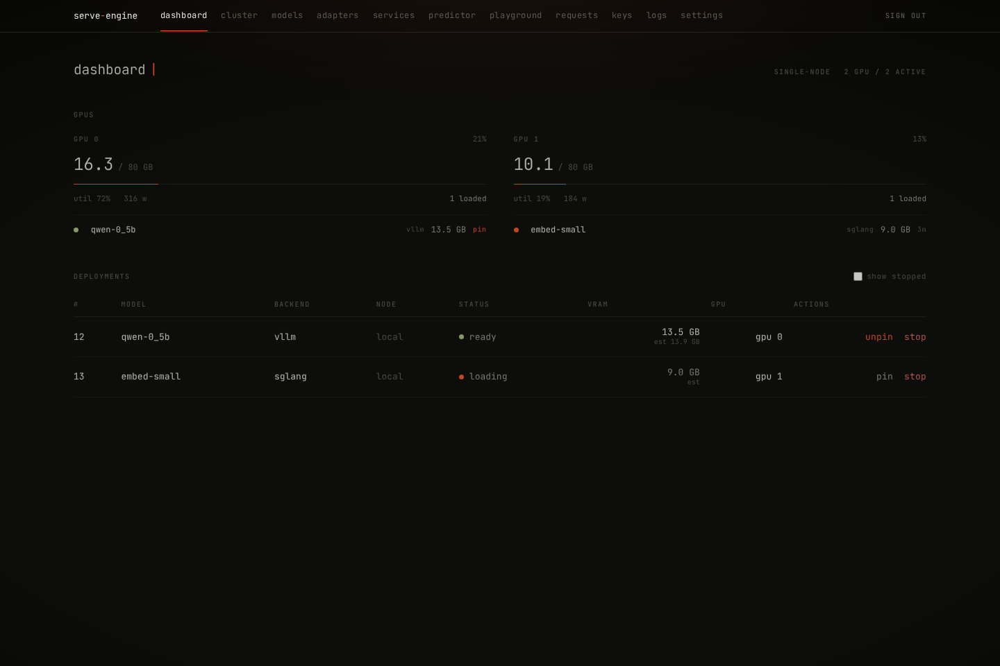

# serve-engine

[](https://github.com/Mapika/serve-engine/actions/workflows/ci.yml)
[](https://github.com/Mapika/serve-engine/actions/workflows/release.yml)


serve-engine is a small inference control plane for GPU boxes.

It gives a host one OpenAI-compatible endpoint and manages the boring parts
behind it: start containers, stop them, check health, route requests, expose
metrics, keep state, and clean up after failures. vLLM, SGLang, and TensorRT-LLM
still do the inference. serve-engine is the layer around them.

The taste of the project is deliberately narrow:

- Engines should be swappable.
- Public model names should be routes, not accidents of whatever is currently
  running.
- One GPU box should not need Kubernetes just to serve a few models reliably.
- If something cannot fit on the GPU, fail before turning the host into an OOM
  experiment.

This is not trying to be a full ML platform. It is the thing I wanted between
"run this container by hand" and "stand up a cluster stack".



## When To Use It

Use serve-engine if:

- You have one GPU box, or a few GPU boxes, and want one API endpoint.
- You want vLLM/SGLang/TRT-LLM to stay replaceable.
- You care about explicit routes, API keys, metrics, logs, and predictable
  cleanup.
- You would rather fail a launch than discover overload through a host OOM.

Do not use it if:

- You need Kubernetes-scale scheduling.
- You are training or fine-tuning.
- You need multi-host tensor parallelism.
- You want a managed cloud abstraction.

## What Works

- Single-node NVIDIA hosts
- Docker-backed lifecycle for engine containers
- vLLM and SGLang tested end to end through the router on a real GPU
- TensorRT-LLM backend adapter present
- OpenAI-compatible `/v1/chat/completions`, `/v1/completions`,
  `/v1/embeddings`, and `/v1/models`
- Model registry, deployments, service profiles, and explicit route rules
- LoRA adapter registry, download, hot-load, and unload paths
- API keys, admin keys, and request/token rate limits
- Prometheus metrics, GPU stats, request tracing, lifecycle events, logs, and
  `serve top`
- Web UI bundled into the Python package, including cluster, services, keys,
  logs, requests, and playground views

There is also a secure-by-default multi-node path: a leader serves the public
API, and GPU agents dial back over mTLS WebSocket. Remote deployments start,
stop, proxy, and stream logs through that tunnel. I still think the best
starting point is one box; the multi-node path is there when the second box is
actually useful.

## Non-Goals

- Training
- Multi-host tensor parallelism
- Being a new inference engine
- Making adapters or LoRA the center of the project
- Replacing Kubernetes for people who already need Kubernetes

## Requirements

- Linux
- NVIDIA GPU
- Docker 24+ with NVIDIA GPU access
- Python 3.11+
- [`uv`](https://docs.astral.sh/uv/) recommended

## Compatibility

This is the test surface I actively care about right now:

| Area | Current posture |
|---|---|
| OS | Linux |
| GPU | NVIDIA |
| Container runtime | Docker 24+ with NVIDIA GPU access |
| Python | 3.11+ |
| Engines | vLLM and SGLang tested end to end; TensorRT-LLM adapter present |
| State | SQLite under `~/.serve` |
| Multi-node | Leader plus mTLS WebSocket agents; tunneled data plane |
| UI | Bundled Vite/React build served by the daemon |

## Install

From source:

```bash
git clone https://github.com/Mapika/serve-engine
cd serve-engine
uv tool install --editable .
serve doctor
```

From a GitHub release wheel:

```bash
uv tool install \
  https://github.com/Mapika/serve-engine/releases/download/v0.2.2/serve_engine-0.2.2-py3-none-any.whl
serve doctor
```

The project is not published to PyPI yet. Releases are GitHub artifacts for
now.

For development:

```bash
git clone https://github.com/Mapika/serve-engine
cd serve-engine
uv venv
source .venv/bin/activate
uv pip install -e ".[dev]"
serve doctor
```

Daemon in a container:

```bash
git clone https://github.com/Mapika/serve-engine
cd serve-engine
docker build -f docker/daemon.Dockerfile -t serve-engine:dev .
docker run -d --name serve \
  --network host \
  -v ~/.serve:/root/.serve \
  -v /var/run/docker.sock:/var/run/docker.sock \
  serve-engine:dev
```

The daemon container does not run inference itself. It talks to the host Docker
socket and starts separate engine containers.

If `serve` is already taken by an existing shell alias (for example
`alias serve='python -m http.server'`), invoke as `python -m berth` or
`unalias serve`.

## First Run

Start the daemon:

```bash
serve daemon start
serve daemon status
```

By default the public listener binds to `0.0.0.0:11500` and serves HTTPS with a
generated serve-engine CA. For local-only testing, set
`SERVE_PUBLIC_BIND=127.0.0.1`. For internet-facing use, I prefer putting
Caddy/Nginx in front with `serve deploy bootstrap --behind-proxy`.

Create an admin key:

```bash
serve key create web --tier admin
```

Save the printed `secret:` value:

```bash
export SERVE_TOKEN=sk-...
export SERVE_URL=https://127.0.0.1:11500
```

Open the web UI at:

```text
https://127.0.0.1:11500/
```

Paste the admin key when prompted. Browsers and SDKs will warn on the generated
CA unless you trust it locally or configure `[public_tls]`. The curl examples
below use `-k` for first-run testing against that generated certificate.

Local CLI commands use the daemon Unix socket and do not need the HTTP bearer
token. TCP admin and `/v1/*` requests need a bearer token once any key exists.

## Quick Start

Register and download a small model:

```bash
serve pull Qwen/Qwen2.5-0.5B-Instruct --name qwen-0_5b
```

Start it on GPU 0:

```bash
serve run qwen-0_5b --gpu 0 --engine vllm --pin
serve ps
```

Call the OpenAI-compatible API:

```bash
curl -k "$SERVE_URL/v1/chat/completions" \
  -H "Authorization: Bearer $SERVE_TOKEN" \
  -H 'Content-Type: application/json' \
  -d '{
    "model": "qwen-0_5b",
    "messages": [{"role": "user", "content": "Reply with exactly: OK"}],
    "max_tokens": 8,
    "temperature": 0
  }'
```

Stop it:

```bash
serve stop
```

The happy path looks roughly like this:

```text
$ serve pull Qwen/Qwen2.5-0.5B-Instruct --name qwen-0_5b
registered qwen-0_5b
downloaded model files

$ serve run qwen-0_5b --gpu 0 --engine vllm --pin
deployment 1 loading
deployment 1 ready

$ serve ps
ID  MODEL     BACKEND  GPU  STATUS  PIN
1   qwen-0_5b vllm     0    ready   yes

$ curl -k "$SERVE_URL/v1/chat/completions" ...
{"choices":[{"message":{"role":"assistant","content":"OK"}}]}
```

## Service Routes

The direct model commands are enough for one-off runs. Use service profiles
when you want repeatable launch settings and a stable public model name.

Create a vLLM service profile:

```bash
curl -k -X POST "$SERVE_URL/admin/service-profiles" \
  -H "Authorization: Bearer $SERVE_TOKEN" \
  -H 'Content-Type: application/json' \
  -d '{
    "name": "qwen-vllm",
    "model_name": "qwen-vllm",
    "hf_repo": "Qwen/Qwen2.5-0.5B-Instruct",
    "backend": "vllm",
    "gpu_ids": [0],
    "max_model_len": 1024,
    "target_concurrency": 4
  }'
```

Deploy it:

```bash
curl -k -X POST "$SERVE_URL/admin/service-profiles/qwen-vllm/deploy" \
  -H "Authorization: Bearer $SERVE_TOKEN"
```

Expose it as a public model name:

```bash
curl -k -X POST "$SERVE_URL/admin/routes" \
  -H "Authorization: Bearer $SERVE_TOKEN" \
  -H 'Content-Type: application/json' \
  -d '{
    "name": "chat-default",
    "match_model": "chat",
    "profile_name": "qwen-vllm",
    "priority": 10
  }'
```

Call the route:

```bash
curl -k "$SERVE_URL/v1/chat/completions" \
  -H "Authorization: Bearer $SERVE_TOKEN" \
  -H 'Content-Type: application/json' \
  -d '{
    "model": "chat",
    "messages": [{"role": "user", "content": "Hello"}],
    "max_tokens": 64
  }'
```

Switch `"backend": "vllm"` to `"backend": "sglang"` for the same profile shape
on SGLang.

## Concepts

**Model**

A named Hugging Face repository entry. The model name is what local commands
and direct `/v1/*` calls usually target.

**Service profile**

A saved launch definition: backend, image, model, args, GPU placement,
concurrency, context length, timeout policy, and optional `node_label`.

**Deployment**

A running engine container for one model/profile. Deployments move through
`loading`, `ready`, `stopped`, and `failed`, and can live on the leader or on
an enrolled agent node.

**Route**

A rule that maps an incoming OpenAI `model` value to a primary service profile
and optional fallback. The proxy rewrites the upstream model name to the served
base model or adapter slot.

**Adapter**

A LoRA adapter tied to a base model. It can be downloaded or registered from
disk, then hot-loaded into a ready backend that supports adapters.

**Node**

The leader host or an enrolled agent host. Nodes report GPU inventory,
heartbeat, and metrics. Service profiles can target a node by label.

**Backend**

The adapter that knows how to launch a specific engine. Engine-specific argv,
ports, health paths, metrics paths, and memory headroom live behind this
interface.

## CLI

```text
serve doctor              check host requirements
serve setup               first-run wizard
serve daemon start        start the daemon
serve daemon stop         stop the daemon
serve daemon status       show daemon status
serve pull <repo>         register and download model files
serve ls                  list registered models
serve run <name>          start a deployment
serve pin <name>          keep a deployment loaded
serve unpin <name>        allow idle eviction
serve ps                  list deployments
serve stop [<id>]         stop one deployment or all deployments
serve top                 terminal dashboard
serve logs                tail engine container logs
serve key create          create an API key
serve key list            list key prefixes
serve key revoke <id>     revoke a key
serve adapter ...         manage LoRA adapters
serve nodes ...           enroll, list, inspect, and remove agent nodes
serve agent ...           register and run an agent host
serve config ...          inspect and edit listener/TLS config
serve backup create       snapshot db, CA, key pepper, and config
serve predict             inspect predictor candidates and usage history
serve update-engines      check for newer pinned engine tags
```

Useful `serve run` options:

```text
--engine vllm|sglang|trtllm
--gpu 0
--gpu 0,1
--node gpu-rig-2
--ctx 8192
--max-seqs 32
--idle-timeout 300
--pin
--image <image:tag>
--extra '--some-engine-flag=value'
```

A non-pinned deployment is evicted once `now - last_request_at` exceeds
`--idle-timeout` seconds (default 300).

## Architecture

```text
SDK / browser / Prometheus
        |
        | HTTPS :11500
        v
  public_app
  /v1/*, /admin/*, /metrics, UI
        |
        | shared state
        v
  LifecycleManager + router + metrics + predictor
        |
        +-- local node: Docker API -> engine container
        |
        `-- remote node: AgentLink over mTLS WebSocket
                         -> agent Docker API -> engine container

local CLI
        |
        | Unix socket ~/.serve/sock
        v
  uds_app, same manager and state

agent hosts
        |
        | HTTPS/mTLS :11501
        v
  cluster_app
  /cluster/agent, /admin/nodes/register, /admin/ca.pem
```

Runtime choices:

- One daemon process builds three FastAPI apps: public, cluster, and local UDS.
- All three apps share one SQLite connection, lifecycle manager, event bus,
  request tracer, metrics aggregator, and node registry.
- The public app serves `/v1/*`, authenticated `/admin/*`, `/metrics`, and the
  bundled UI. It also owns startup/shutdown background tasks.
- The cluster app only serves the agent WebSocket, enrollment registration, and
  CA endpoint, so it can be firewalled separately from the public API.
- Engine services run as Docker containers on the leader or on an enrolled
  agent. Remote start, stop, health probe, proxy, and logs go through
  `AgentLink`.
- The proxy resolves routes and adapters, ranks ready deployments with node
  signals and affinity, retries pre-first-byte failures for bare-base requests,
  and records usage/token counters.
- State lives in SQLite under `~/.serve`.
- Engine defaults come from `src/berth/backends/backends.yaml`.
- Per-host engine overrides live in `~/.serve/backends.override.yaml`.

## Files

By default, serve-engine owns `~/.serve`. Override it with `SERVE_HOME`.

```text
~/.serve/
|-- db.sqlite               models, deployments, profiles, routes, keys, usage
|-- sock                    local CLI control socket
|-- config.toml             listener, TLS, and proxy-header config
|-- key_pepper              API-key HMAC pepper; back up with db.sqlite
|-- ca/                     leader cluster CA and server cert material
|-- ca.crt                  agent-side pinned CA after registration
|-- agent.crt               agent-side mTLS client certificate
|-- agent.key               agent-side mTLS client key
|-- agent.yaml              agent connection config
|-- logs/
|   `-- daemon.log          daemon stdout and stderr
|-- models/                 downloaded Hugging Face model files
|   `-- models--owner--repo/snapshots/revision/
|-- configs/                per-deployment engine configs
|-- predictor.yaml          optional prewarm and prediction tuning
`-- backends.override.yaml  optional engine image and headroom overrides
```

## Operator Notes

- Run `serve doctor` before chasing ghosts.
- Use `serve ps` for deployment state.
- Use `serve logs` when an engine fails to become healthy.
- Use `/admin/events` or `serve top` for lifecycle visibility.
- Use the web UI's Requests view when proxy routing or token accounting looks
  wrong.
- Use `--pin` for services that should stay loaded.
- Use `--idle-timeout` for services that should leave the GPU when quiet.
- Use service profiles when launch arguments need to be repeatable.
- Use routes when the public model name should not be tied to one backend.
- Use `serve nodes enroll <label>` when a second GPU host is worth the added
  moving parts.
- If something weird happens, see [docs/troubleshooting.md](docs/troubleshooting.md).

## More Docs

- [Deployment guide](docs/deploy.md)
- [Caddy reverse proxy notes](docs/caddy.md)
- [Multi-node guide](docs/multi-node.md)
- [Predictor/prewarm notes](docs/predictor.md)
- [Troubleshooting](docs/troubleshooting.md)
- [Release process](docs/release.md)
- [Examples](examples/)

## Performance Snapshot

Single H100 80 GB, Qwen2.5 0.5B and 1.5B, 512-token outputs, Poisson arrivals.

| QPS | Model and Engine | Agg TPS | TTFT p50 ms | E2E p50 ms |
|---:|---|---:|---:|---:|
| 1 | 0.5B vLLM | 355 | 25 | 1134 |
| 16 | 0.5B vLLM | 7169 | 33 | 1429 |
| 32 | 0.5B SGLang | 14751 | 68 | 1280 |
| 16 | 1.5B SGLang | 7904 | 38 | 1608 |
| 32 | 1.5B vLLM | 13377 | 128 | 2814 |

Treat these as a smoke test with numbers, not a benchmark paper. Engine version,
model family, context length, quantization, and GPU all matter.

## GPU Sharing

Two deployments can share a GPU. Before starting one, the daemon estimates its
VRAM cost from the model config: weights at the chosen dtype, KV cache for
`--ctx` and `--max-seqs`, plus engine headroom. It only places the deployment on
GPUs where that fits alongside what is already running. If nothing fits, it
evicts non-pinned idle deployments in LRU order. If it still cannot fit, it
fails with a placement error instead of racing the existing services into an
OOM.

## Development

```bash
uv venv
source .venv/bin/activate
uv pip install -e ".[dev]"
uv lock --check
uv run ruff check src tests
uv run mypy src
uv run pytest tests/unit tests/integration
```

UI build:

```bash
cd ui
npm ci
npm run build
```

## Out Of Scope For V1

- Multi-host tensor parallel inference
- Training or fine-tuning
- Full autotuning of tensor parallelism, dtype, and context length
- Built-in ACME/certificate management
- A Kubernetes replacement

For internet-facing use, prefer `serve deploy bootstrap --behind-proxy` with a
TLS-terminating reverse proxy, or configure `[public_tls]` with an
operator-managed certificate.

## Multi-Node (Secure-by-Default)

A leader serves the OpenAI API and admin API. Additional GPU hosts run a thin
agent that dials home over mTLS WebSocket. The leader terminates TLS itself, so
a reverse proxy is optional, and the public and cluster listeners have separate
trust boundaries.

See **[docs/multi-node.md](docs/multi-node.md)** for the full operator
guide (same-network and cross-network setup, public-cert configuration,
internet-exposure hardening, troubleshooting, roadmap).

## License

Apache 2.0. See [LICENSE](LICENSE).
