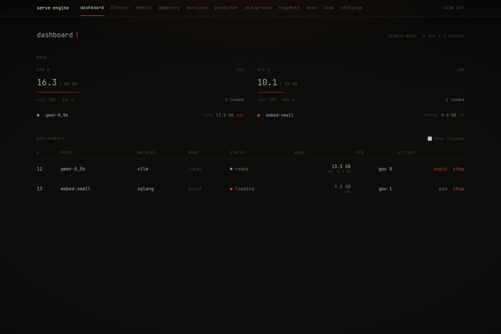

# berth

berth is a small control plane for serving models on your own GPU boxes.

It gives a host one OpenAI-compatible endpoint and takes care of the tedious
parts behind it: starting engine containers, stopping them, health checks,
routing requests, metrics, keeping state, and cleaning up when something falls
over. vLLM, SGLang, and TensorRT-LLM do the actual inference. berth is the layer
around them.

I wanted something that sat between "run this container by hand" and "stand up a
Kubernetes cluster." One GPU box shouldn't need an orchestration stack to serve a
few models reliably.

[](https://github.com/Mapika/berth/actions/workflows/ci.yml)
[](https://github.com/Mapika/berth/actions/workflows/release.yml)




## Quick start

You'll need Linux, an NVIDIA GPU, Docker 24+ with GPU access, and Python 3.11+.

```bash
git clone https://github.com/Mapika/berth && cd berth
uv tool install --editable .
berth doctor                 # checks Docker, GPUs, ports, images
```

Start the daemon and put a model on a GPU:

```bash
berth setup                  # starts the daemon, mints an admin key, prints the URL
berth pull Qwen/Qwen2.5-0.5B-Instruct --name qwen
berth run qwen --gpu 0       # vLLM by default; --engine sglang or trtllm to switch
berth ps
```

Then call it like any other OpenAI endpoint:

```bash
export BERTH_TOKEN=sk-...     # the admin key berth setup printed
curl -k https://127.0.0.1:11500/v1/chat/completions \
  -H "Authorization: Bearer $BERTH_TOKEN" \
  -H 'Content-Type: application/json' \
  -d '{"model":"qwen","messages":[{"role":"user","content":"Say hi"}]}'
```

The web UI is at `https://127.0.0.1:11500/`. Paste the admin key and you get
deployments, GPUs, routes, keys, logs, requests, and a playground.

## What it does

- One OpenAI-compatible API: `/v1/chat/completions`, `/v1/completions`,
  `/v1/embeddings`, `/v1/responses`, and `/v1/models`.
- vLLM and SGLang tested end to end on real GPUs, with a TensorRT-LLM adapter in
  the tree. The engines stay swappable.
- GPU-aware placement. Before starting a model berth estimates its VRAM cost and
  only puts it where it fits. If nothing fits it evicts idle deployments; if it
  still can't fit it fails the launch instead of racing the host into an OOM.
- Public model names are routes, not whatever happens to be running. Service
  profiles save repeatable launch settings; routes map a public name to one.
- Adopt a server you already started. Point berth at a running
  OpenAI-compatible container or port and it routes to it without taking over its
  lifecycle.
- LoRA adapters: register, download, hot-load, and unload against a ready
  backend.
- API keys, admin keys, and per-key request and token rate limits.
- Prometheus metrics, GPU stats, request tracing, lifecycle events, logs, and a
  `berth top` terminal view.
- A web UI bundled into the package and served by the daemon, so there's nothing
  extra to deploy.
- A secure multi-node path for when one box isn't enough: a leader serves the
  API and GPU agents dial back over an mTLS WebSocket. See the
  [multi-node guide](docs/multi-node.md).

## When it fits

Reach for berth if you have one GPU box, or a few, and want a single API in front
of them; if you want vLLM/SGLang/TRT-LLM to stay replaceable; and if you care
about explicit routes, keys, metrics, logs, and predictable cleanup. It's
happiest when you'd rather fail a launch than find overload through a host OOM.

It's the wrong tool if you need Kubernetes-scale scheduling, you're training or
fine-tuning, you need multi-host tensor parallelism, or you want a managed cloud
abstraction. It isn't trying to be a full ML platform or a new inference engine.

## Install

The usual path installs the `berth` CLI with uv:

```bash
uv tool install --editable .            # from a source checkout
# or a pinned release wheel, no clone needed:
uv tool install \
  https://github.com/Mapika/berth/releases/download/v0.5.0/berth-0.5.0-py3-none-any.whl
berth doctor
```

It isn't on PyPI yet; releases are GitHub artifacts for now.

<details>
<summary><b>A public leader on a VPS (one command)</b></summary>

On a fresh Ubuntu/Debian host, once DNS points at it:

```bash
sudo ./scripts/setup-leader-vps.sh example.com
```

This installs `berth` as the operator command, provisions TLS through HAProxy and
Caddy, bootstraps the CA, database, and first admin key, and starts the systemd
service. Full notes in [docs/deploy.md](docs/deploy.md).
</details>

<details>
<summary><b>A development checkout</b></summary>

```bash
git clone https://github.com/Mapika/berth && cd berth
uv venv && source .venv/bin/activate
uv pip install -e ".[dev]"
berth doctor
```
</details>

<details>
<summary><b>The daemon in a container</b></summary>

```bash
docker build -f docker/daemon.Dockerfile -t berth:dev .
docker run -d --name berth --network host \
  -v ~/.berth:/root/.berth \
  -v /var/run/docker.sock:/var/run/docker.sock \
  berth:dev
```

The daemon container doesn't run inference itself. It talks to the host Docker
socket and starts engine containers next to it.
</details>

## How it works

One daemon process runs three FastAPI apps over shared state (a single SQLite
database under `~/.berth`):

- a public app for `/v1/*`, `/admin/*`, `/metrics`, and the UI on HTTPS :11500;
- a cluster app for the agent mTLS WebSocket and enrollment on :11501, so it can
  be firewalled apart from the public API;
- a local app over a Unix socket for CLI commands, which don't need a token.

Engines run as Docker containers on the leader or on an enrolled agent. Remote
start, stop, proxy, and log streaming go over the agent link. The proxy resolves
routes and adapters, ranks the ready deployments, retries failures before the
first byte, and records usage and token counts. State stays in SQLite; engine
defaults live in `src/berth/backends/backends.yaml`, with per-host overrides in
`~/.berth/backends.override.yaml`.

<details>
<summary><b>Architecture sketch</b></summary>

```text
SDK / browser / Prometheus
        |
        | HTTPS :11500
        v
  public_app
  /v1/*, /admin/*, /metrics, UI
        |
        | shared state
        v
  LifecycleManager + router + metrics + predictor
        |
        +-- local node: Docker API -> engine container
        |
        `-- remote node: AgentLink over mTLS WebSocket
                         -> agent Docker API -> engine container

local CLI
        |
        | Unix socket ~/.berth/sock
        v
  uds_app, same manager and state

agent hosts
        |
        | HTTPS/mTLS :11501
        v
  cluster_app
  /cluster/agent, /admin/nodes/register, /admin/ca.pem
```
</details>

## Going further

- [Multi-node setup](docs/multi-node.md): a leader plus mTLS agents, on the same
  network or across the internet, with hardening notes.
- Adopting a running server: `berth agent adopt --container <name>` (or
  `--port`) hands an existing OpenAI endpoint to the leader's gateway. See the
  [details](docs/multi-node.md#adopting-an-externally-hosted-model).
- Service routes: stable public names backed by saved profiles. There are
  ready-made examples in [examples/](examples/).
- Production and TLS: [docs/deploy.md](docs/deploy.md), or run behind a reverse
  proxy with the [Caddy notes](docs/caddy.md).
- [Predictor and prewarm](docs/predictor.md), and
  [troubleshooting](docs/troubleshooting.md) for when something misbehaves.

## Reference

<details>
<summary><b>CLI commands</b></summary>

```text
berth doctor              check host requirements
berth setup               first-run wizard
berth status              show daemon health
berth daemon start        start the daemon
berth daemon stop         stop the daemon
berth daemon status       show daemon status
berth pull <repo>         register and download model files
berth ls                  list registered models
berth run <name>          start a deployment
berth pin <name>          keep a deployment loaded
berth unpin <name>        allow idle eviction
berth ps                  list deployments
berth stop [<id>]         stop one deployment or all deployments
berth top                 terminal dashboard
berth logs                tail engine container logs
berth key create          create an API key
berth key list            list key prefixes
berth key revoke <id>     revoke a key
berth adapter ...         manage LoRA adapters
berth nodes ...           enroll, list, inspect, and remove agent nodes
berth agent ...           register and run an agent host, or adopt a server
berth config ...          inspect and edit listener/TLS config
berth backup create       snapshot db, CA, key pepper, and config
berth predict             inspect predictor candidates and usage history
berth update-engines      check for newer pinned engine tags
berth wipe                reset local berth state
```

Common `berth run` options:

```text
--engine vllm|sglang|trtllm
--gpu 0
--gpu 0,1
--node gpu-rig-2
--ctx 8192
--max-seqs 32
--idle-timeout 300
--pin
--image <image:tag>
--extra '--some-engine-flag=value'
```

A non-pinned deployment is evicted once it's been idle past `--idle-timeout`
seconds (default 300).
</details>

<details>
<summary><b>What lives in ~/.berth</b></summary>

berth owns `~/.berth` by default. Override it with `BERTH_HOME`.

```text
~/.berth/
|-- db.sqlite               models, deployments, profiles, routes, keys, usage
|-- sock                    local CLI control socket
|-- config.toml             listener, TLS, and proxy-header config
|-- key_pepper              API-key HMAC pepper; back up with db.sqlite
|-- ca/                     leader cluster CA and server cert material
|-- ca.crt                  agent-side pinned CA after registration
|-- agent.crt               agent-side mTLS client certificate
|-- agent.key               agent-side mTLS client key
|-- agent.yaml              agent connection config
|-- logs/
|   `-- daemon.log          daemon stdout and stderr
|-- models/                 downloaded Hugging Face model files
|-- configs/                per-deployment engine configs
|-- predictor.yaml          optional prewarm and prediction tuning
`-- backends.override.yaml  optional engine image and headroom overrides
```
</details>

<details>
<summary><b>Performance snapshot</b></summary>

Single H100 80 GB, Qwen2.5 0.5B and 1.5B, 512-token outputs, Poisson arrivals.

| QPS | Model and Engine | Agg TPS | TTFT p50 ms | E2E p50 ms |
|---:|---|---:|---:|---:|
| 1 | 0.5B vLLM | 355 | 25 | 1134 |
| 16 | 0.5B vLLM | 7169 | 33 | 1429 |
| 32 | 0.5B SGLang | 14751 | 68 | 1280 |
| 16 | 1.5B SGLang | 7904 | 38 | 1608 |
| 32 | 1.5B vLLM | 13377 | 128 | 2814 |

These are a smoke test with numbers, not a benchmark paper. Engine version, model
family, context length, quantization, and GPU all change the picture.
</details>

## Docs

[Deployment](docs/deploy.md) · [Multi-node](docs/multi-node.md) ·
[Caddy](docs/caddy.md) · [Predictor](docs/predictor.md) ·
[Troubleshooting](docs/troubleshooting.md) · [Release process](docs/release.md) ·
[Examples](examples/)

Upgrading an older install? See [docs/upgrade-0.4.md](docs/upgrade-0.4.md).

## License

Apache 2.0. See [LICENSE](LICENSE).
